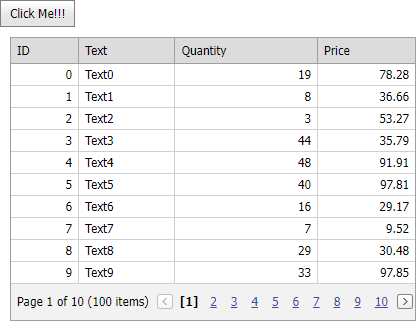

<!-- default badges list -->

<!-- default badges end -->

# Grid View for MVC - How to Use the jQuery.ajax Function with DevExpress MVC Extensions

<!-- run online -->
**[[Run Online]](https://codecentral.devexpress.com/e4063/)**
<!-- run online end -->

This example demonstrates how to use the [jQuery.ajax](https://api.jquery.com/jquery.ajax/) function to load a GridView on a callback.

**Note:** This feature has been implemented in v.12.1. For earlier versions, you can use a solution demonstrated in the following example: [How to load MVC extensions using the CallbackPanel extension](https://github.com/DevExpress-Examples/how-to-load-mvc-extensions-using-the-callbackpanel-extension-e2927).

## Files to Look At

* [Index.cshtml](./CS/AjaxSupport/Views/Home/Index.cshtml)
* [HomeController.cs](./CS/AjaxSupport/Controllers/HomeController.cs) (VB: [HomeController.vb](./VB/AjaxSupport/Controllers/HomeController.vb))
* [GridViewPartial.cshtml](./CS/AjaxSupport/Views/Home/GridViewPartial.cshtml)

## Documentation

* [GridViewExtension](https://docs.devexpress.com/AspNetMvc/DevExpress.Web.Mvc.GridViewExtension)

## More Examples

* [How to use the GridView extension in Full Screen mode (100% browser Width and Height)](https://github.com/DevExpress-Examples/how-to-use-the-gridview-extension-in-a-full-screen-mode-100-browser-width-and-height-e3958)
* [GridView - How to edit in memory data source](https://github.com/DevExpress-Examples/gridview-how-to-edit-in-memory-data-source-e3983)
* [How to bind GridView to XPO in Server Mode](https://github.com/DevExpress-Examples/how-to-bind-gridview-to-xpo-in-server-mode-e2836)